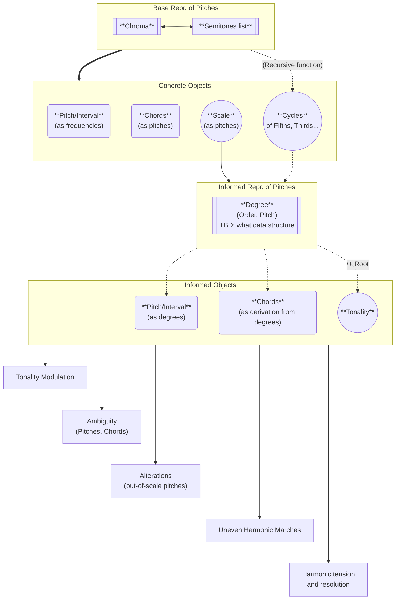

Several representations possible, with different pros and cons.

# Fundamental representations
#### Chroma representation -> [[Chroma objects]]
Standard representation of twelve-tone (or more) objects

>- Easy transformations (rotation, shift, inversion)
>- Easy combinations (tuples of constant size) : addition, difference, logic operations
>- Vectorization of operations
>- Ambiguous representation of shift-independent objects (chords)
>- Reverse lookup can be cumbersome : need to loop over the values if you want to know about the order of ones and zeros.

>- Complex objects (Cycles, Scales) cannot be represented with it : they have non-binary information on pitches (pitch -> order or order -> pitch, or degree -> pitch and pitch -> degree with sometimes a pitch having no degree)

>[!info] see extended Chroma

#### Semitones representations (list of semitones)
Allows to create functions that go from pitch to another information (Complex objects)

>The list object is sometimes complex to handle
>	- mutable
>	- variable length. Example: a Chord can be of length 3, 4, 5, etc...
>	- iteration, reverse lookup, checks very often needed : is a pitch in the list ? Which is the index of a given semitone (if it exists)

# Standard representations
- For a Note : Letter representation, C, C#, Db.... Which serves as a basis for the following :
- For a Chord : Letter representation, Am7, AbM7, Em7b5...
- For a Scale : Root and mode, F Lydian, C Aeolian...
>- Intuitive, but needs to be parsed for their content
>- Ambiguous : a Db does not mean the same thing in the tonality of C or Gb. Chords are simplified to their shape independently of their functional role.
>- Incomplete : Only common chords and scales are represented

>[!summary] This is an overlay upon the other representations. Can serve as an interface for I/O

# Complex representations
#### Degrees and alterations
The notion of degree and alteration seems to stem from the notion of Scale (which is a pure chroma). The notes in the scale constitute degrees that become reference points for the diverse other musical objects :
	- Pitches
	- Intervals
	- Chords
#### Pitches
- A Pitch can be represented as a unitary Chroma (``ChromaPitch``)
- However it can also be seen as a degree that has been altered or not (bemolized 7th, sharp 5th, bemolized third, etc).
- This information cannot be encoded in the Chroma
- ==Also, it cannot be derived from the Chroma + Scale : The 6th semitone in a Ionian Scale can be a diminished fifth or an augmented fourth.==

>[!abstract] A Scaled Pitch is only a ``Degree``
#### Intervals
- Intervals can be seen as the semitones distance between two pitches (``ChromaInterval``)
- However, they can also be seen as derived from degrees on a scale, altered or not. The problem is exactly equivalent to the problem of Pitches, with the added information that an interval is between two pitches.
	- What is, in C Ionian, an ``Interval((3,-1), (6,+1))`` ?
	- If both pitches are altered, the interpretation can become complex.
		- ==But the pitches still give the melodic movement.==
		- And if we consider C Aeolian we get ``Interval((3,0), (7,0))`` or maybe ``Interval((3,0), (6,+2))``=>``Interval((3,0), (7,0))`` by cancellation of +2 alterations.
		- It remains to know how we choose the likeliness of one interpretation over the others, probably a mix of : closeness of tonality, number of alterations.
		- ==A big question is if (C Ionian) Interval((0,0),(6,+1)) and Interval((0,0), (7,-1)) are strictly the same when interpreting the interval within F Ionian. We get Interval((0,0), (7,0)) starting on Vth degree when cancelling the accidentals. However, there intervals are really seventh in the F scale, not 6th. Autrement dit est-ce qu'en F Ionian le Sib c'est vraiment un (7 -1) par rapport au C Ionian, ou juste une autre note équivalent à un (7 -1) ou à un (6 +1) en C Ionian ?==
			- La réponse est à trouver dans le cycle des quintes, qui risque de poser problème car il est circulaire, mais solvable.

>[!abstract] A Scaled Pitch (or ``Degree``) is only a ``ScaledInterval`` to the Root.

#### ==An object that would represent a degree indepently of a Scale, or that would represent a degree in all Scales ?==
>[!warning] Here I mix up Scale and Tonality (which is a Scale + a Root)

> [!warning]
 Pitches and Intervals if they are considered only relative to a Tonality can get cumbersome to compare.
 Example : $Degree(1, 0)$ for Tonality $C_{\text{ionian}}$ = $Degree(5,0)$ for Tonality $F_{\text{ionian}}$
 >
 To circumvent these difficulties we need a common reference for all tonality i.e the Pitch (in Chroma-semitones) of their root and the Chroma of their scale.
 >
 Also
 >- the passage to one scale to another must be made easy by these common references
 >- Same for the passage from one tonality to another, with the same scale.
 
 

#### ExtendedChroma
$f:\mathcal{P} \rightarrow \mathbb{E}$ avec $\mathbb{E}$ un ensemble quelconque défini dans l'Object

>- Can define arbitrary lookup functions from E to P
>- Loses the ease of use for Chroma : transformations, shift, inversion, combinations... these need to be defined, and can be different between objects.
>- Basically a Tone-aware representation of a  list. Can be built as object or as functions on the lists.
>==Needs to be developed==

#### What I need
A representation is a way to access information.
The difficulty here is that the objects have intricate relationships. But it can be summarized this way :

Tableau des scales en chroma -> numpy diff gives pitch accidental equivalence to a reference

Tableau des scales en semitones -> numpy diff ??

Fast lookup of a Pitch semitones with or without accidental

==> Fast lookup of a similar interval
Interval(4, 7) = aug 4th based on semitone 5 en C
VS Interval(0,4) = P4 based on semitone 5 en F

Tonality = Scale + root
=> operations on pure Scales
=> operations on Tonalities + scales.
		-> easy way to convert from a Scale + root to a Chroma OR a semitones list
		-> degree -> semitones [list of semitones]
		-> extended chroma with the degree ? semitones -> degree.

**Possibly tableau avec 2 dimensions (semitones, accidentals) and index = degree**
OR tableau avec 2 dimensions (degree | 0, accidentals) and index = semitones

